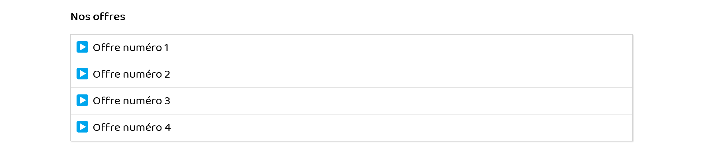
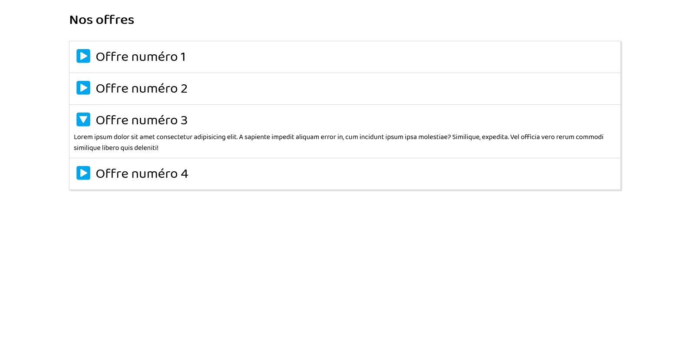

# Accordéon

## Objectif
Vous devez réaliser une liste en "accordéon" avec ouverture au clic sur mobile et au survol sur ordinateur dans les captures ci-dessous.

## Résultat

Stocker l'ensemble de vos codes soit sur un dépôt GIT ou sur CodePen au choix.
